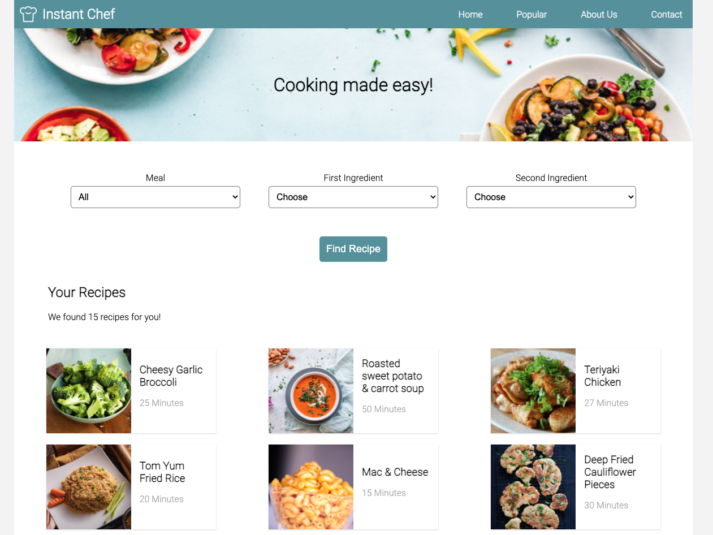

# Instant Chef!
Instant Chef is an application to quickly find simple, easy to cook recipes by searching for which ingredients you already have in your fridge. The project is currently a series of static HTML pages which dynamically generates links to recipes from a database stored in the file: data.js

This project written by Liana, Jana and Tim was our first project at the Wild Code School. 

View the live site at <https://instant-chef.netlify.app/>

## Requirements & Installation
To use this project on your own server, simply clone the code and serve the pages on an HTTP server.

Alternatively, you could use Parcel to build a minified version.

## Usage
Simply use the dropdown selectors to filter recipes by the meal type or ingredients. 

To add a recipe, add a new Recipe object to the data.js file

### Credits
- Liana van Zyl - <https://github.com/Li-create2021>
- Jana Kudlickova - <https://github.com/JanaKudlickova>
- Tim Coggins - <https://github.com/timcoggins>

### License
